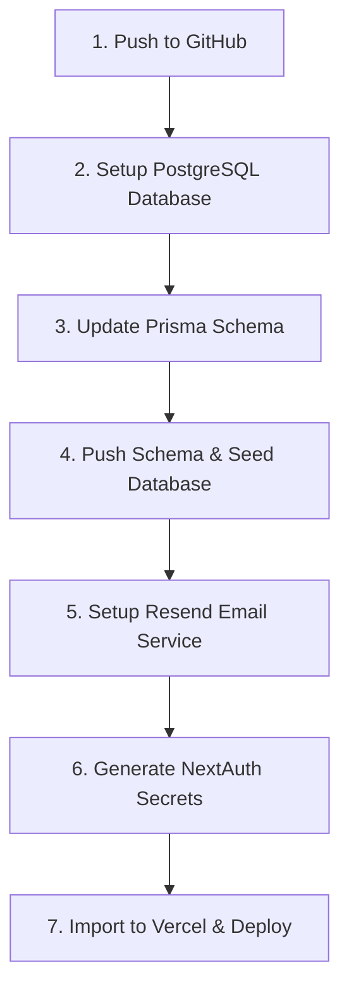

# Vercel Deployment Checklist & Steps

This checklist outlines the exact steps to transition this repository from its local SQLite setup to a live production deployment on Vercel.

---



---

## 📋 Phase 1: Git & GitHub Setup
1. **Initialize Git (if not done already)**:
   ```bash
   git init
   ```
2. **Ensure correct `.gitignore`**:
   Make sure `.env`, `node_modules/`, and `.next/` are not tracked by Git.
3. **Commit your changes**:
   ```bash
   git add .
   git commit -m "build: fix vercel build issue with prisma client"
   ```
4. **Push to GitHub**:
   Create a new repository on [GitHub](https://github.com) and run:
   ```bash
   git remote add origin <your-github-repo-url>
   git branch -M main
   git push -u origin main
   ```

---

## 🗄️ Phase 2: Production Database Setup (Neon / Supabase)
SQLite is stored in a local file (`prisma/dev.db`). Because Vercel's serverless architecture is stateless, local files are deleted every time the container recycles. You must use a hosted database.

1. **Create a Cloud Database**:
   - Go to [Neon.tech](https://neon.tech) or [Supabase.com](https://supabase.com).
   - Create a free project and database instance.
   - Copy the **Connection String** (e.g. `postgresql://...`).

2. **Update Prisma Schema**:
   Change the provider from `sqlite` to `postgresql` in [schema.prisma](file:///c:/Users/Moses%20Fernando/Documents/GitHub/project-finder/prisma/schema.prisma#L1-L4):
   ```prisma
   datasource db {
     provider = "postgresql"
     url      = env("DATABASE_URL")
   }
   ```

3. **Migrate & Seed the Production Database**:
   - Temporarily update your local `.env` file's `DATABASE_URL` with your new production connection string.
   - Run the following commands to create the tables in PostgreSQL and populate the initial database seed (like admin users):
     ```bash
     npx prisma migrate dev --name init_postgresql
     npx prisma db seed
     ```
   - *Note: Restore your local `dev.db` URL in `.env` if you want to keep using SQLite for local development.*

---

## ✉️ Phase 3: Setup Email Service (Resend)
In development, OTP codes are logged to the console. In production, emails must be dispatched to users signing up.

1. **Sign Up on Resend**:
   - Visit [resend.com](https://resend.com) and create a free account.
   - Generate a new **API Key** (e.g. `re_...`).
2. **Configure Domain (Optional but Recommended)**:
   - Under **Domains** on Resend, add your domain (e.g. `yourdomain.com`) and add the DNS records to your registrar.
   - If you don't have a domain, you can test with Resend's default onboarding address, but it will **only** send emails to the email address you signed up to Resend with.

---

## 🔐 Phase 4: Configure NextAuth (Auth.js) Secrets
1. **Generate the AUTH_SECRET**:
   NextAuth requires a secure random 32-character string to encrypt tokens.
   Run this in your terminal to generate a secure secret:
   ```bash
   node -e "console.log(require('crypto').randomBytes(32).toString('hex'))"
   ```
   Save the output key (e.g. `4b8c...`).

---

## 🚀 Phase 5: Import & Deploy on Vercel
1. Go to the [Vercel Dashboard](https://vercel.com) and click **Add New > Project**.
2. Import your GitHub repository.
3. In **Environment Variables**, add the following keys:

| Environment Variable | Description / Example |
| :--- | :--- |
| `DATABASE_URL` | Your hosted PostgreSQL connection string (from Neon or Supabase) |
| `AUTH_SECRET` | The 32-character NextAuth secret you generated |
| `RESEND_API_KEY` | Your Resend API key (`re_...`) |
| `EMAIL_FROM` | The sender address (e.g. `noreply@yourdomain.com` or `onboarding@resend.dev` for onboarding testing) |
| `NEXTAUTH_URL` | Your live deployment URL (e.g. `https://your-app.vercel.app`) |

4. Click **Deploy**. Vercel will automatically run `prisma generate && next build` and deploy your app.
